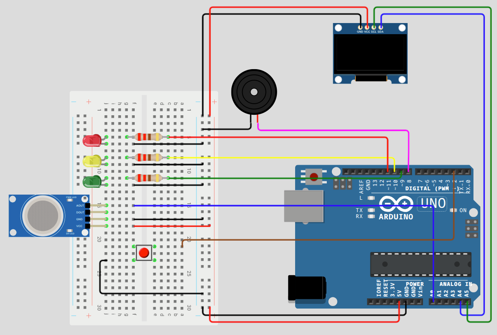

# Gas Sense - Sistem Deteksi Kebocoran Gas LPG

Sistem berbasis Arduino Uno (simulasi Wokwi) yang dirancang untuk mendeteksi dini kebocoran gas LPG menggunakan sensor MQ-2. Proyek ini dilengkapi dengan indikator visual (LED), audio (Buzzer), dan tampilan informasi pada layar OLED.

## Fitur Utama
- **Deteksi Real-time:** Memantau kadar gas secara terus-menerus.
- **Indikator Visual:** Menggunakan 3 buah LED (Hijau, Kuning, Merah) untuk status keamanan.
- **Alarm Suara:** Buzzer dengan suara sirine ambulan untuk kondisi Bahaya.
- **Tampilan Informasi:** Layar OLED 128x64 untuk status teks dan grafik bar.
- **Mekanisme Reset Manual:** Tombol interupsi untuk mematikan alarm secara manual.

---

## Ambang Batas Deteksi (Threshold)
Berdasarkan standar keamanan, sistem dikalibrasi dengan parameter berikut (PPM - *Parts Per Million*):
- **Aman:** < 300 PPM
- **Waspada:** 300 - 400 PPM
- **Bahaya:** > 400 PPM

### Kalibrasi MQ-2 (Wokwi ADC)
Karena sensor MQ-2 pada simulasi Wokwi menggunakan pembacaan analog (ADC 200 - 1010), berikut adalah hasil kalibrasi yang digunakan dalam kode:

| Status | Slider PPM (Wokwi) | Nilai ADC | Indikator |
| :--- | :--- | :--- | :--- |
| **Aman** | < 300 | < 886 | LED Hijau Nyala |
| **Waspada** | 300 - 400 | 886 - 907 | LED Kuning Berkedip |
| **Bahaya** | > 400 | >= 908 | LED Merah Berkedip & Sirine |

---

## Alat dan Bahan
- **Mikrokontroler:** Arduino Uno
- **Sensor:** Modul MQ-2 (VCC, GND, Analog OUT)
- **Output Visual:** 
  - LED (Merah, Kuning, Hijau)
  - Resistor 220 Ohm
  - OLED Display 128x64 I2C (0x3C)
- **Output Audio:** Buzzer
- **Input:** Push Button (sebagai tombol Reset/Interrupt)
- **Lainnya:** Kabel Jumper

---

## Konfigurasi Pin Arduino

| Komponen | Pin Arduino | Keterangan |
| :--- | :--- | :--- |
| **LED Merah** | 11 | PWM |
| **LED Kuning** | 10 | PWM |
| **LED Hijau** | 9 | PWM |
| **Buzzer** | 8 | Tone Output |
| **Push Button** | 2 | Interrupt 0 (INT0) |
| **Sensor MQ-2** | A0 | Analog Input |
| **OLED SDA** | A4 | I2C Data |
| **OLED SCL** | A5 | I2C Clock |

---

## Logika Sistem

### 1. Kondisi Aman
- LED Hijau menyala statis.
- Layar OLED menampilkan status "AMAN".
- LED Merah dan Kuning mati.

### 2. Kondisi Waspada
- LED Kuning berkedip (*blink*).
- Layar OLED menampilkan status "WASPADA".
- LED Hijau dan Merah mati.

### 3. Kondisi Bahaya
- LED Merah berkedip (*blink*).
- Buzzer berbunyi dengan nada sirine ambulan.
- Layar OLED menampilkan status "BAHAYA!".
- **Penting:** Buzzer akan tetap berbunyi meskipun kondisi gas kembali ke Aman/Waspada, sampai tombol reset (Pin 2) ditekan secara manual.

---

## Diagram Skematik

## Cara Menggunakan (Simulasi Wokwi)
1. Buka proyek pada [Wokwi](https://wokwi.com).
2. Tekan tombol **Start Simulation**.
3. Klik pada sensor **MQ-2** untuk memunculkan slider PPM.
4. Geser slider untuk mensimulasikan kenaikan kadar gas.
5. Jika alarm berbunyi (Kondisi Bahaya), tekan tombol untuk mematikan suara buzzer.

